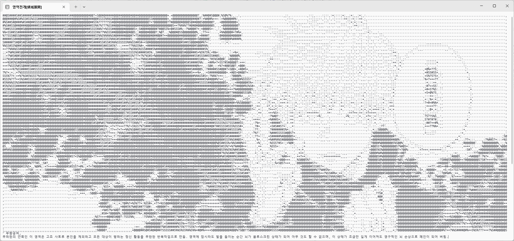

# Unlimited Void

무량공처 프로그램.
## 하는일
팩토리얼을 끝없이 계산하여 컴퓨터를 무한히 갈궈줍니다.  
제한시간: 6145020초 (기본값)  
## 파라미터
- ``-T (시간)``,``-time (시간)`` : 제한시간 설정. (시간은 유리수)
- ``-L (ko 또는 en)``,``--language (korean 또는 english)`` : 언어 설정.
- ``-?`` , ``--help`` : 도움말 표시.
## 왜만듬
렉 만드는 프로그램이 필요해서.
## 디버깅
vs2022 에서 .sln 열고 F5.  
***특히 Release로 디버깅하면 효과가 매우 좋음!!!!!!***